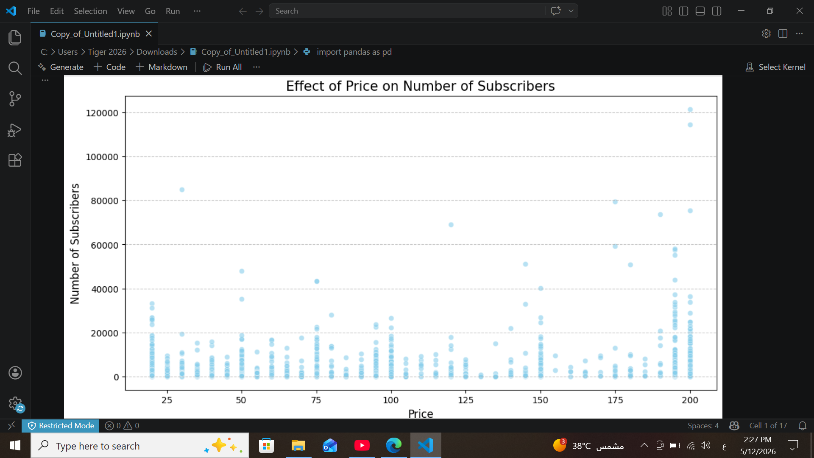
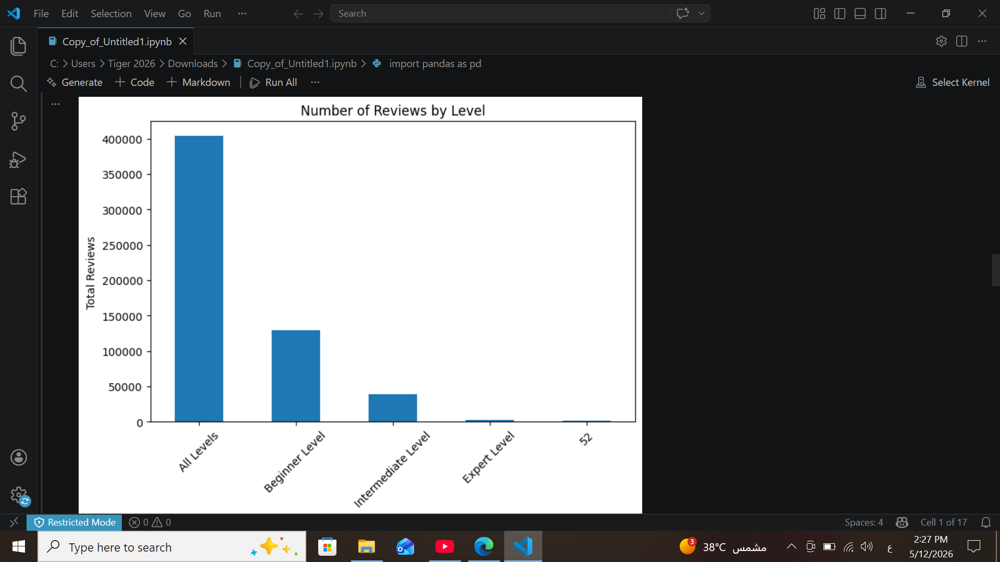
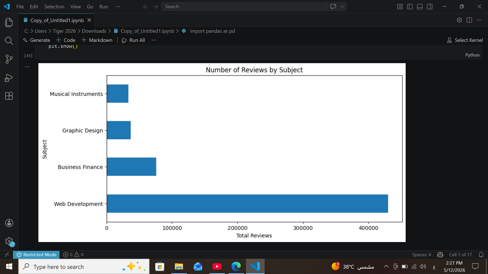
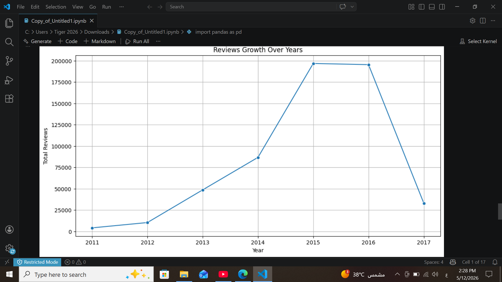
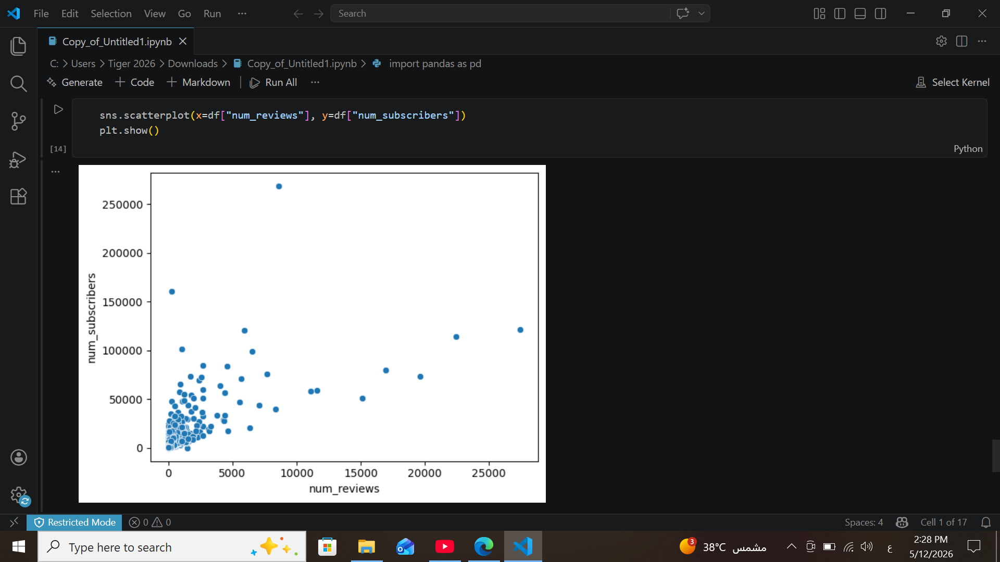
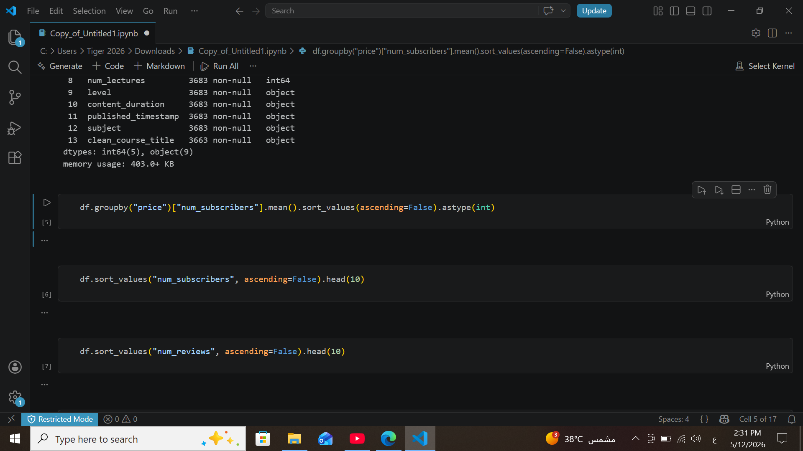

This project focuses on analyzing data from Udemy, the world's leading online learning platform and the largest marketplace for courses globally and in the Arab world. With millions of students and thousands of topics, this analysis aims to decode the success factors behind top-performing courses
#############################################################
​📈 Strategic Insights & Key Findings
​1️⃣ Price vs. Popularity (The Value Factor)
​Observation: The "Price on Number of Subscribers" scatter plot reveals high student density across all price points, including premium courses priced at $200.
​Conclusion: Price is not the primary barrier to entry; Value and Quality are the real drivers. High-ticket courses still attract hundreds of thousands of subscribers if the perceived educational return is high

  

​2️⃣ Learning Difficulty Trends
​Observation: The highest engagement (Reviews) comes from "All Levels" courses, followed closely by "Beginner Level" content.
​Conclusion: Learners prefer comprehensive paths that start from scratch. There is a notable scarcity of "Expert Level" courses, representing a significant Market Gap for high-end, specialized content.

  

​3️⃣ .Web Development Dominance (Market Demand)
​Observation: Based on the "Number of Reviews by Subject" chart, Web Development shows an overwhelming lead compared to other categories like Business, Design, and Musical Instruments.
​Conclusion: This category is the platform's primary revenue engine. Marketing efforts and instructor partnerships should prioritize this field to maximize ROI and maintain market leadership.

  

​4️⃣ Historical Growth & Performance Peak
​Observation: The "Reviews Growth Over Years" chart indicates a massive surge starting in 2013, reaching its absolute peak between 2015-2016, followed by a sharp decline in 2017.
​Conclusion: This era was the platform's "Golden Age." The 2017 drop requires further investigation—potentially due to data cut-offs or shifts in platform algorithms—to avoid similar trends in future planning.

  

​5️⃣ Correlation: Reviews & Subscribers (The Power of Social Proof)
​Observation: There is a strong Positive Correlation between the number of reviews and the total subscriber count.
​Conclusion: Reviews act as the ultimate "Social Proof" marketing tool. Strategically increasing review volume directly enhances user trust, which in turn accelerates conversion rates and sales.

  

Code from the project

  

